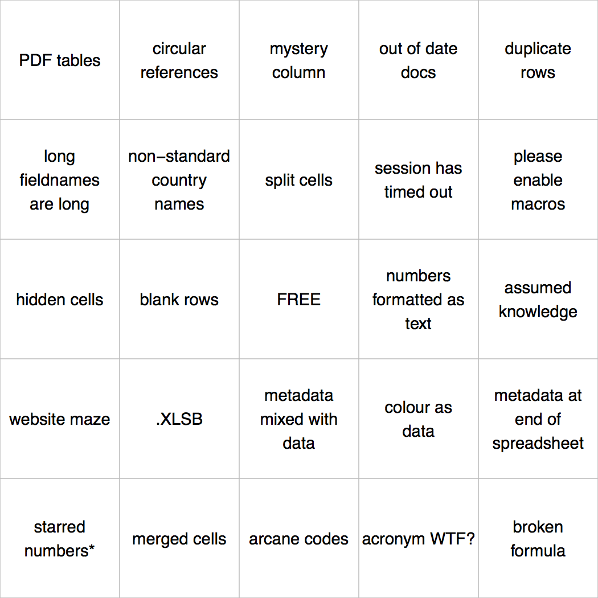

-   [bingo](#bingo)
    -   [Installation](#installation)
    -   [SuperBowl Example](#superbowl-example)
    -   [Open Data Example](#open-data-example)
    -   [Run Shiny apps locally](#run-shiny-apps-locally)

<!-- README.md is generated from README.Rmd. Please edit that file -->
bingo
=====

Generate Bingo cards.

Currently has built-in squares for SuperBowl 50 :football: and open data / spreadsheet craziness :chart\_with\_downwards\_trend:. Or you can provide your own text for the squares.

Make printable Bingo cards **without installing anything** via these Shiny apps (included in package, but also available on Dean's server):

-   [PDF cards](http://daattali.com/shiny/bingo-pdf/)
-   [HTML cards](http://daattali.com/shiny/bingo-html/)

Feel free to help us make these cards less ugly or to explore new bingo topics! PRs welcome :grin:.

Installation
------------

Install from github with:

``` r
# install.packages("devtools")
devtools::install_github("jennybc/bingo")
```

SuperBowl Example
-----------------

``` r
library(bingo)

## see some of the SuperBowl 50 squares
tail(superbowl_50_2016())
#> [1] "Shot of Golden Gate Bridge"                
#> [2] "\"Silicon Valley and tech\" blah blah blah"
#> [3] "Mike Carey is WRONG"                       
#> [4] "Unexpected artist joins Beyoncé"           
#> [5] "Cam's Superman shirt-opening thing"        
#> [6] "Idle speculation it's Peyton's last game"

## make 8 bingo cards (SuperBowl 50 is current default)
bc <- bingo(8)

## print them to PDF
plot(bc)
#> Writing to file ...
#>   ./bingo-01.pdf
#>   ./bingo-02.pdf
#>   ./bingo-03.pdf
#>   ./bingo-04.pdf
#>   ./bingo-05.pdf
#>   ./bingo-06.pdf
#>   ./bingo-07.pdf
#>   ./bingo-08.pdf
```

Here's what one looks like:


Open Data Example
-----------------

These squares are taken from an excellent tweet from Chris McDowall ([@fogonwater](https://twitter.com/fogonwater)):

> For two weeks I noted issues encountered as I used NZ govt data. Today I collected enough to make a bingo card. *[@fogonwater, January 3, 2016](https://twitter.com/fogonwater/status/683785398112260097)*

``` r
## see some of the Open Data squares
tail(open_data())
#> [1] "colour as data"            "merged cells"             
#> [3] "acronym WTF?"              "starred numbers*"         
#> [5] "PDF tables"                "numbers formatted as text"

## make a single Open Data bingo card
bc <- bingo(bs = open_data())

## print it
plot(bc)
#> Writing to file ...
#>   ./bingo-01.pdf
```

Here's what one looks like:



Run Shiny apps locally
----------------------

To run the apps we're running remotely ([PDF version](http://daattali.com/shiny/bingo-pdf/), [HTML version](http://daattali.com/shiny/bingo-html/)) on your own machine, do this:

``` r
## pdf is the default
launch()

## or go with html
launch("html")
```
